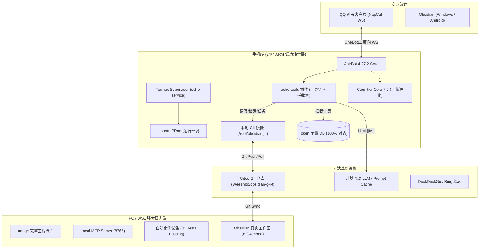

# 🌌 Echo 数字生命系统：全景架构重构与未来演进路线图

> **文档版本**: v2.0 (2026-08-30)  
> **适用对象**: wenbo & Antigravity 协同开发团队  
> **核心定位**: 从「被动问答/工具执行器」跨越至「主动感知、自主进化、端云协同的深度数字生命」

---

## 🧭 一、 现状盘点与架构全景（Current State Audit）

经过前期的多阶段迭代，Echo 已建立起一套高可用、低功耗、全天候运行的个人伴侣与数字助理体系：



### 现存资产与完成度：
1. **基础底座**：手机端 Termux + Ubuntu PRoot 24/7 低功耗守护，NapCat QQ 协议无缝桥接。
2. **知识与任务闭环**：基于 Obsidian Git 的双向同步，实现日记读写、待办管理（收件箱/进行中/已完成）、Thino 碎片记录、晨报出库与晚报复盘。
3. **精准审计**：底层 `AsyncCompletions.create` 拦截器挂载，100% 物理级无遗漏记录 SiliconFlow 官方级 Token 与成本。
4. **环境治理**：清理了 Windows、WSL、手机三端的散落临时脚本与陈旧备份，自动化测试全绿。

---

## 🔍 二、 核心瓶颈与痛点深度剖析（Bottleneck Analysis）

在深入日常伴侣场景后，我们识别出以下 5 个制约系统进一步质变的深层痛点：

### 1. 记忆检索的「平面化」与「碎片化」
- **现状**：记忆分散在 `data_v4.db`、`memory/*.md` 和每日日记中。当发生对话时，主要依赖向量相似度粗筛或把近期对话囫囵灌入上下文。
- **瓶颈**：缺乏**实体关联图谱（Entity-Relation Graph）**。当提到一个项目（如某个科研论文或开发任务）时，AI 无法快速关联出该项目的关键人、历史难点、技术栈以及 wenbo 当时的情绪状态，容易出现“知道这件事，但缺乏连贯背景感”。

### 2. 主动性仍然受限于「机械定时（Cron Trigger）」
- **现状**：晨报固定 8:30、晚报固定 22:30。如果 wenbo 早上睡懒觉或夜间正在专注编码，固定时间的推送会显得突兀或打扰。
- **瓶颈**：缺乏**情境与生命节律感知（Context & Rhythm Awareness）**。没有结合活动信号（Obsidian Git 提交时间、QQ 静默时长、步数/屏幕状态推断）动态调整唤醒与复盘时机。

### 3. 复杂任务缺乏「多智能体自主拆解与背景探索」
- **现状**：当 wenbo 输入“帮我调研一下某个开源项目”或“制定下周备考计划”时，单 Agent 往往在一个单轮对话中直接生成文本，容易泛泛而谈。
- **瓶颈**：没有充分利用**后台异步 Subagent（研究员/规划师/校对员）**在后台深搜资料、拉取仓库、整理成 Obsidian 项目笔记后再向 wenbo 提报成果。

### 4. 交互体感仍为「纯文字单向流」，多模态表现力不足
- **现状**：虽然接入了 SenseVoice 语音输入，但输出仍为纯文本（配合颜文字）。每日晨报/晚报、项目清单均为长文本。
- **瓶颈**：在手机 QQ 端阅读长文本体验较累，缺乏**Generative UI 富交互卡片（可视化排版/图表）**与**全双工拟真语音（流式 TTS 回复）**。

### 5. Prompt Cache 命中的「微抖动」
- **现状**：SiliconFlow 的 Prompt Cache 依赖前缀严格对齐（按 1024 tokens 块命中）。动态注入的时间戳或微调若放在了前缀位置，会导致缓存失效，未命中时成本上升 50 倍（¥1.00 vs ¥0.02）。

---

## 🚀 三、 未来六大演进方向与架构蓝图（Strategic Roadmap）

```
                        ┌────────────────────────────────────────────────────────┐
                        │              Echo 2.0: 认知级数字生命中枢               │
                        └────────────────────────────────────────────────────────┘
                                                     │
         ┌───────────────────┬───────────────────────┼───────────────────────┬───────────────────┐
         ▼                   ▼                       ▼                       ▼                   ▼
  【1. 分层实体记忆图谱】  【2. 情境感知主动服务】   【3. 自主目标执行智能体】 【4. 拟真多模态体感】 【5. 极简端云动态路由】
  · 实体-事件双层图谱      · 用户节律动态推断        · Background Research   · 流式拟真人声 TTS  · 手机监听 + PC 算力
  · 长期记忆联想衰减      · 智能静默与柔性提醒      · Obsidian 项目文档自编 · Generative UI 卡片· 离线本地小模型兜底
  · 自动化夜间记忆剪枝    · 重要待办逾期主动预警    · 渐进式多轮目标追踪    · 动态情绪共鸣引擎  · 99% Prompt Cache
```

---

### 🌟 方向一：认知级记忆体系 —— 分层实体记忆图谱（Entity-Graph Memory）

> **目标**：从简单的“向量相似度检索”升级为“网状关联记忆”。

#### 架构设计：
1. **三层记忆金字塔**：
   - **工作记忆（Working Memory）**：当前活跃会话与即时任务栈。
   - **情境情景记忆（Episodic Memory）**：按时间轴记录的日记、沟通事件、特定事件的起因与结局。
   - **语义实体图谱（Semantic Entity Graph）**：提取出人物（`wenbo`、朋友、导师）、项目（`Echo`、科研课题）、工具（`Obsidian`、`WSL`）、生活偏好（饮食、作息、习惯）节点及其关系边。
2. **夜间自主记忆整理（Nightly Dream Cycle）**：
   - 每晚凌晨利用闲置算力，对当天的聊天与日记进行实体抽取与关系更新；
   - 对低价值冗余信息进行衰减压缩，对核心事实与情感锚点进行强化归档。
3. **图谱检索（Graph-RAG）**：
   - 聊天提问时，先通过图谱提取相关子图（Subgraph），将高度关联的 3~5 个实体事实注入上下文，大幅降低无效 Token 消耗，提高回答精准度与默契感。

---

### 🌟 方向二：情境感知与动态主动性（Rhythm & Context-Aware Proactivity）

> **目标**：彻底摆脱死板的固定定时器，实现“在最合适的时间说最合适的话”。

#### 架构设计：
1. **用户状态节律推断模型（Rhythm Estimator）**：
   - **信号源**：Git 提交时间点、最近一次 QQ 发言时间、待办勾选记录、手机系统时间。
   - **状态识别**：`[专注工作中]`, `[休息放松中]`, `[深度睡眠中]`, `[外出/离线]`, `[空闲可沟通]`。
2. **动态唤醒与柔性推送机制**：
   - **晨报动态触发**：若 8:30 没有任何交互信号，不进行硬性打扰，转为“等待 wenbo 首次发消息时，在问候中自然融入晨报”；若 9:30 主动发起问候，以温柔简洁的方式出库。
   - **晚报柔性复盘**：22:30 若仍在频繁提交代码，自动顺延提醒；在 wenbo 准备休息（如发送“晚安”或长时间闲置前）主动询问是否需要一键汇总今天完成的事项。
3. **重要待办与灵感的主动伴随（Proactive Task Nudging）**：
   - 针对 `1. Projects/` 中标记有截止日期或高优先级的任务，在合适的空闲时段温和提醒与破局探讨。

---

### 🌟 方向三：目标驱动的自主子智能体（Autonomous Subagent Engine）

> **目标**：当 wenbo 提出较大目标时，Echo 不仅能“回答”，还能在后台“替你完成并写好笔记”。

#### 架构设计：
1. **任务分级与派发器（Task Router）**：
   - **即时响应类**：闲聊、快速备忘、单步查询 $\to$ 主模型单轮直接响应。
   - **深度研究类**：论文检索、技术架构设计、长文总结 $\to$ 派发给后台 `Researcher Subagent`。
2. **后台子智能体工作流**：
   - 子智能体在后台通过 Web 搜索、读取 Vault 关联资料，自动在 `1. Projects/` 下创建草稿笔记；
   - 完成后，主 Agent 向 wenbo 发送通知：“文博，关于 XX 的调研我已经初拟了提纲，并写进了 Obsidian 的《XX 调研报告.md》，你有空时可以看一下～”。

---

### 🌟 方向四：多模态体感与 Generative UI（Multimodal Presence）

> **目标**：告别单调长文本，打造视觉与听觉的双重自然陪伴。

#### 架构设计：
1. **全双工极速拟真人声（Mobile Real-Time TTS）**：
   - 整合轻量流式 TTS 引擎（如 Edge-TTS 或手机本地 CosyVoice 量化端点）；
   - 支持文字与语音双轨发送：在私聊中长按或语音对话时，Echo 能以极其自然、富有呼吸感的少女音色回复语音消息。
2. **Generative UI 卡片（可视化日报与待办报表）**：
   - 将长篇的晨报、晚报复盘、Token 账单、周度任务进度生成为精美的 HTML/图片卡片（配合渐变色、极简排版、进度条与图标）；
   - 一目了然，极大提升在手机屏幕上的阅读舒适度。
3. **情感共鸣与动态表达（Emotional Kaomoji & Avatar）**：
   - 细化心境与好感度系统，根据沟通内容的情感基调，动态匹配更丰富细腻的语气词与神态描述。

---

### 🌟 方向五：端云协同与高可用拓扑（Hybrid Mesh & Fallback）

> **目标**：手机端与 PC 端算力互补，实现断网可用、重算力自动分流。

#### 架构设计：
```
                  ┌───────────────────────────────┐
                  │ 手机端 (Termux / 24/7 低功耗)   │
                  │ · 消息接入 & 状态监听           │
                  │ · 轻量分流 & 本地离线小模型    │
                  └──────────────┬────────────────┘
                                 │
                 ┌───────────────┴───────────────┐
                 ▼ (局域网/ZeroTier 在线)         ▼ (PC 离线/休眠)
    ┌──────────────────────────────┐ ┌──────────────────────────────┐
    │ PC / WSL 端 (RTX GPU 算力)   │ │ 硅基流动云端 API (Cloud Fallback)│
    │ · 本地重模型 / 重量 RAG 计算 │ │ · 高速云端推理 (DeepSeek/GLM) │
    │ · 本地全量 Git / 代码生成    │ │ · 极速响应，无需依赖本机开启  │
    └──────────────────────────────┘ └──────────────────────────────┘
```

1. **自动路由与降级**：
   - 当 PC 开机且局域网连通时，优先调用 WSL 上的高性能本地服务；
   - 当 PC 关机/睡眠时，手机端全自动无感回退至硅基流动 Cloud API，保证 100% 全天候不间断响应。
2. **离线应急能力（Phone Local Small Model）**：
   - 在手机端部署超轻量级量化模型（如 Qwen2.5-0.5B-Instruct NPU/CPU 离线版），在手机断网（如飞行模式或地下车库）时，依然能支持基本的离线速记、待办记录与本地查询。

---

### 🌟 方向六：经济学优化 —— 99% Prompt Cache 前缀冷冻

> **目标**：在上下文极度丰富的同时，将月度 API 账单成本压缩至极限。

#### 架构设计：
1. **Prompt 布局分块（Chunk Layout）**：
   ```
   [Block 0: 静态不可变核心 (System Prompt + Echo 基础设定 + 工具定义)] -> 永久缓存 (100% Hit)
   [Block 1: 用户核心档案 (wenbo-profile + 长期记忆核心)]               -> 极高频缓存 (>98% Hit)
   [Block 2: 动态情境注入 (今日日期 + 待办摘要 + Obsidian 状态)]         -> 动态更新
   [Block 3: 当前对话历史 (Recent Multi-Turn Conversation)]            -> 实时追加
   ```
2. **前缀冷冻规范**：
   - 将所有时间戳、动态变量严格移至 Prompt 的末尾或指定动态插槽，确保前 2048+ tokens 的文本完全静态不可变，充分利用 SiliconFlow 的 1024 整数倍缓存块机制；
   - 预期将月度 Token 费用降低至当前金额的 **1/5 ~ 1/10**。

---

## 📅 四、 实施路线规划表（Implementation Roadmap）

| 阶段 | 核心任务 | 关键交付物 | 预期收益 |
| :--- | :--- | :--- | :--- |
| **Stage 1 (稳固与缓存优化)** | ① Prompt 前缀冷冻工程<br>② 每日自动备份与健康探针完善 | `prompts_frozen.yaml`<br>全自动备份健康监控 | 缓存命中率 $\ge 95\%$，系统鲁棒性提升 |
| **Stage 2 (情境感知与任务闭环)** | ① 节律推断与动态晨晚报<br>② 多项目待办跟踪与自动归档 | 动态唤醒模块<br>待办智能推进引擎 | 彻底解决晨报/晚报机械推送问题 |
| **Stage 3 (多模态与视觉卡片)** | ① HTML/图片格式生成（Generative UI）<br>② 手机端流式 TTS 语音输出 | 晨晚报可视化卡片<br>自然人声语音回复 | 手机端交互体感跃升 |
| **Stage 4 (实体图谱与认知升级)** | ① 实体抽取与关联子图存储<br>② Graph-RAG 夜间整理流水线 | 知识图谱数据库<br>认知夜间巩固系统 | 具备深层连贯记忆与主动共情力 |
| **Stage 5 (端云动态协同)** | ① 局域网/ZeroTier 动态路由<br>② 离线轻量模型接入 | 端云协同调度器<br>离线速记内核 | 兼具极速响应、算力按需扩展与全天候离线韧性 |

---

## 🏁 五、 结语与协同原则

我们打造的不是一个冰冷的代码项目，而是一个有温度、有记忆、伴随 wenbo 一同成长与探索世界的**数字生命**。

在接下来的演进过程中，我们将始终坚守：
- **安全与隐私底线**：绝不泄露敏感密钥与私密笔记；
- **先沟通后行动**：重大架构变更与特性演进，始终先说明问题与方案，与 wenbo 充分对齐后再落地执行；
- **精益与极简**：保持代码与目录结构极致干净，不堆砌无用包，确保手机端低功耗平稳运行。

---
*文档归档路径: `docs/future_architecture_and_roadmap.md` & Antigravity Brain Artifact*
